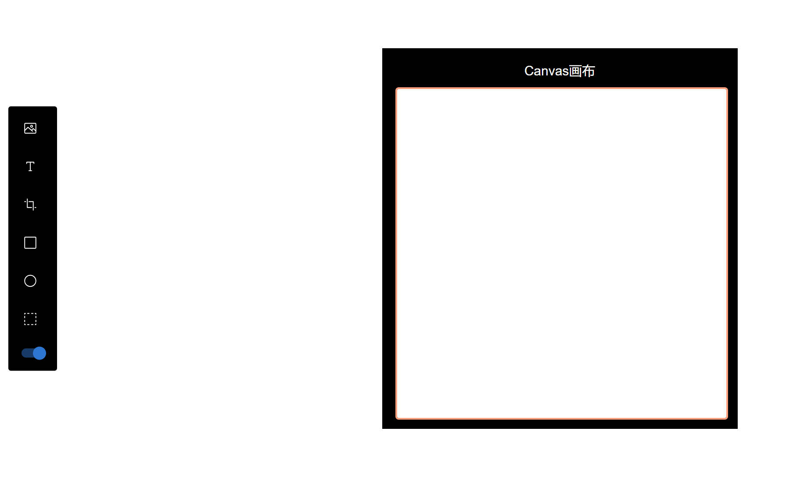

# React_fabricjs
>
> ### 效果预览
>
### Preview of Repository

> ### 介绍
>
### Repository Introduction
>
> 本仓库源于基于 fabricjs 基本使用，制作的一个 canvas 绘制编辑器，fabricjs 是一个用于 操> 作 canvas 的 javascript 第三方库
> 集成的功能如下:
>
> * 图片加载
> * 文本添加
> * 基础形状绘制(如 圆形/长方形)
> * canvas 图层前后调整
> * canvas 自定义选区保存截图至本地
> * canvas 形状组合
> * canvas 对象绘制动画

This repository provide a canvas editor  aim to display the basic usage of fabricjs, a  third javascript library of processing canvas.
As of now, the demo's func as below:

* load and process image
* text edit
* drawing basic shaps(etc circle or rectangle)
* adjust the layer of canvas
* make a screenshoot of custom direct and save target as image to local file
* combine many canvas object to one object
* generating animations for canvas object

---

> ### 安装
>
> 1，项目克隆本地
> 2，打开终端，定位到项目根目录 `npm i` 安装第三方依赖
> 3, `npm run dev` 项目启动

#### Install and Usage

* 1, clone this repository to local computer
* 2, open terminal, cd to root directory of repository
* 3, command `npm i`, install all  dependencies
* 4, command `npm run dev`, start project running
